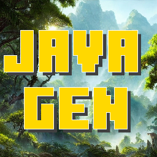

#  ‎ ‎  JavaGen
JavaGen is a PocketMine-MP plugin that provides a fast way to generate the Minecraft **Vanilla terrain** (all dimensions) based on a Java Server

Depending on the biome height, the generation per chunk took from 0.03 to 0.1 seconds during the tests.

The speed of the generator may be influenced by the available hardware power.

## Installation
You need
- [PocketMine-MP API-5](https://github.com/pmmp/PocketMine-MP/releases/latest)
- Java 17
- a java server, preferably a spigot server (everything was tested on a [Paperspigot](https://papermc.io/downloads/paper) server, version 1.20.4))
- [ChunkSender](https://github.com/HimmelKreis4865/ChunkSender/releases/latest) the Java-Plugin, required to use the generator
- There are 3 new generators you can use to generate the vanilla world:
    - overworld: `java_overworld`
    - nether: `java_nether`
    - end: `java_end`

## Ingame footage
- ### A beautiful landscape in the jungle

- ### A deep look in the underground

- ### A landscape in the nether

- ### A very scary place in the nether

- ### "The City at the End of the Game"

## Features
- Full generation of the vanilla terrain in all dimensions (overworld, nether and the end)
- Generation of vanilla-like chest loot
- /locate command to locate biomes and structures close by
- An API for interaction with structures
- Fully configurable messages (for the locate command)

## Known issues
- Missing blocks and items in PocketMine-MP will NOT be generated in the world
- Weird sky color in nether and end dimension
- Java server must be on the same machine as the pocketmine server, port cannot be changed yet

## Any problems or ideas?
Feel free to open an issue on github